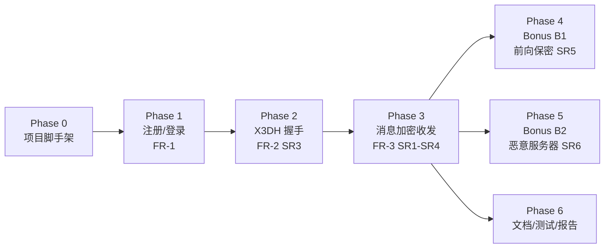

# E2EE 消息系统 — 技术实现文档

## 1. 项目目录结构

```
cyber-project/
├── server/
│   ├── main.py            # FastAPI 应用入口 & 路由注册
│   ├── database.py        # SQLite 连接与 schema 初始化
│   ├── models.py          # Pydantic 请求/响应模型
│   └── auth.py            # 密码哈希与 token 验证
├── client/
│   ├── cli.py             # argparse 命令行入口
│   ├── crypto.py          # 所有密码学操作（PyNaCl）
│   ├── protocol.py        # X3DH 握手 + 消息收发逻辑
│   ├── storage.py         # 本地密钥/会话状态的文件读写
│   └── api.py             # 与服务器的 HTTP 通信封装
├── tests/
│   ├── test_crypto.py     # 密码学单元测试
│   ├── test_protocol.py   # 协议集成测试
│   └── test_security.py   # 安全属性验证（重放/篡改）
├── requirements.txt
└── README.md
```

---

## 2. 依赖清单

```
fastapi>=0.111.0
uvicorn>=0.29.0
pynacl>=1.5.0
cryptography>=42.0.0
httpx>=0.27.0
passlib[bcrypt]>=1.7.4
python-jose>=3.3.0
```

---

## 3. 数据库 Schema（SQLite）

**`users` 表**

| 列 | 类型 | 说明 |
|----|------|------|
| `username` | TEXT PK | 用户名 |
| `password_hash` | TEXT | bcrypt 哈希 |
| `IK_sig_pub` | TEXT | Ed25519 公钥（base64） |
| `IK_dh_pub` | TEXT | X25519 公钥（base64） |
| `SPK_pub` | TEXT | X25519 预密钥公钥（base64） |
| `SPK_sig` | TEXT | IK_sig 对 SPK_pub 的签名（base64） |
| `created_at` | INTEGER | Unix 时间戳 |

**`handshakes` 表**

| 列 | 类型 | 说明 |
|----|------|------|
| `session_id` | TEXT PK | UUID |
| `initiator` | TEXT | 发起方用户名 |
| `responder` | TEXT | 响应方用户名 |
| `EK_pub` | TEXT | 发起方临时公钥（base64） |
| `hs_signature` | TEXT | 握手摘要的 Ed25519 签名 |
| `status` | TEXT | `pending` / `established` |
| `created_at` | INTEGER | |

**`messages` 表**

| 列 | 类型 | 说明 |
|----|------|------|
| `id` | INTEGER PK AUTOINCREMENT | |
| `session_id` | TEXT | 所属会话 |
| `sender` | TEXT | 发送方 |
| `recipient` | TEXT | 接收方 |
| `ciphertext` | TEXT | base64 密文 |
| `seq` | INTEGER | 会话内单调序列号 |
| `ad` | TEXT | Associated Data（JSON） |
| `delivered` | INTEGER | 0/1 |
| `created_at` | INTEGER | |

---

## 4. 服务器 API 规格

### POST `/register`
```json
Request:  { "username": "alice", "password": "xxx",
            "IK_sig_pub": "...", "IK_dh_pub": "...",
            "SPK_pub": "...", "SPK_sig": "..." }
Response: { "ok": true }
```

### POST `/login`
```json
Request:  { "username": "alice", "password": "xxx" }
Response: { "token": "<JWT>" }
```

### GET `/keys/{username}`
```json
Response: { "IK_sig_pub": "...", "IK_dh_pub": "...",
            "SPK_pub": "...", "SPK_sig": "..." }
```

### POST `/handshake`  *(需要 JWT)*
```json
Request:  { "session_id": "<uuid>", "to": "bob",
            "EK_pub": "...", "hs_signature": "...",
            "transcript_hash": "..." }
Response: { "ok": true }
```

### GET `/handshake/{session_id}`  *(需要 JWT)*
```json
Response: { "status": "pending|established",
            "EK_pub": "...", "hs_signature": "..." }
```

### POST `/message`  *(需要 JWT)*
```json
Request:  { "session_id": "...", "to": "bob",
            "ciphertext": "<base64>", "seq": 1,
            "ad": "{...}" }
Response: { "ok": true }
```

### GET `/messages`  *(需要 JWT，长轮询)*
```json
Response: { "messages": [
  { "session_id": "...", "sender": "alice",
    "ciphertext": "...", "seq": 1, "ad": "..." }
]}
```

---

## 5. 密码学实现规格

### 5.1 密钥生成（`client/crypto.py`）

```python
# 使用 PyNaCl，绝不自行实现
import nacl.signing, nacl.public, nacl.secret, nacl.utils

def generate_identity_keys():
    IK_sig = nacl.signing.SigningKey.generate()      # Ed25519
    IK_dh  = nacl.public.PrivateKey.generate()       # X25519
    SPK    = nacl.public.PrivateKey.generate()        # X25519
    # SPK_sig = IK_sig.sign(bytes(SPK.public_key))
    return IK_sig, IK_dh, SPK
```

### 5.2 X3DH-lite 会话密钥派生

```python
# 发起方（Alice）
EK = nacl.public.PrivateKey.generate()   # 临时密钥，用后销毁

DH1 = nacl.public.Box(EK,  bob_IK_dh_pub).shared_key()
DH2 = nacl.public.Box(EK,  bob_SPK_pub).shared_key()
DH3 = nacl.public.Box(alice_IK_dh, bob_SPK_pub).shared_key()

from cryptography.hazmat.primitives.kdf.hkdf import HKDF
from cryptography.hazmat.primitives import hashes
SK = HKDF(SHA256, 32, salt=None, info=b"e2ee-chat-v1").derive(DH1+DH2+DH3)

del EK._private_key   # 前向保密：立即销毁临时私钥
```

### 5.3 消息加密（XChaCha20-Poly1305）

```python
# Associated Data 绑定所有上下文，防止重放和跨会话攻击
ad = json.dumps({
    "session_id": session_id,
    "sender": sender,
    "recipient": recipient,
    "direction": "alice->bob",
    "seq": seq
}).encode()

box = nacl.secret.SecretBox(SK)
# SecretBox 内部使用 XSalsa20-Poly1305；
# 若需 XChaCha20-Poly1305 可用 cryptography 包的 ChaCha20Poly1305
nonce = nacl.utils.random(nacl.secret.SecretBox.NONCE_SIZE)
ciphertext = box.encrypt(plaintext, nonce)
```

### 5.4 握手摘要签名（SR3 发送方认证）

```python
transcript = sha256(
    session_id.encode() +
    alice_EK_pub_bytes +
    bob_IK_dh_pub_bytes +
    bob_SPK_pub_bytes
)
hs_signature = alice_IK_sig.sign(transcript).signature
# Bob 接收后：alice_IK_sig_pub.verify(transcript, hs_signature)
```

### 5.5 序列号管理（SR4 重放保护）

```python
# 发送方：每次 +1，存入 storage
session["seq_send"] += 1

# 接收方：严格检查
if msg_seq != session["seq_recv_expected"]:
    raise ReplayOrReorderError(f"Expected {session['seq_recv_expected']}, got {msg_seq}")
session["seq_recv_expected"] += 1
```

### 5.6 Safety Number（Bonus B2）

```python
import hashlib
def safety_number(my_IK_dh_pub: bytes, peer_IK_dh_pub: bytes) -> str:
    digest = hashlib.sha256(
        sorted([my_IK_dh_pub, peer_IK_dh_pub])[0] +
        sorted([my_IK_dh_pub, peer_IK_dh_pub])[1]
    ).hexdigest()
    # 格式化为 8 组 5 位十进制，便于人工比对
    n = int(digest, 16) % (10**40)
    return " ".join([f"{n//(10**(35-5*i))%100000:05d}" for i in range(8)])
```

---

## 6. 本地密钥存储格式（`~/.e2ee/<username>/`）

```
~/.e2ee/alice/
├── identity.json       # 长期密钥（私钥 base64，600 权限）
└── sessions/
    └── bob_<session_id>.json   # 会话状态
```

`identity.json` 结构：
```json
{
  "username": "alice",
  "IK_sig_private": "<base64>",
  "IK_dh_private":  "<base64>",
  "SPK_private":    "<base64>",
  "server_url":     "http://localhost:8000"
}
```

`sessions/<peer>_<id>.json` 结构：
```json
{
  "session_id":       "<uuid>",
  "peer":             "bob",
  "SK":               "<base64>",
  "seq_send":         3,
  "seq_recv_expected": 2,
  "established_at":   1719000000
}
```

**安全要求**：`identity.json` 文件权限设为 `0o600`；SK 使用后不写磁盘（内存保留，进程退出即消失），或写入时加密存储。

---

## 7. 分阶段实现计划

### Phase 0 — 项目脚手架（验收：可运行）

**目标**：建立目录结构、依赖、数据库初始化

**交付物**：
- `requirements.txt` 完整
- `server/database.py`：`init_db()` 创建三张表
- `server/main.py`：FastAPI 启动，`GET /health` 返回 `{"status": "ok"}`
- `README.md`：安装与启动命令

**验收命令**：
```bash
pip install -r requirements.txt
uvicorn server.main:app --port 8000
curl http://localhost:8000/health  # → {"status":"ok"}
```

---

### Phase 1 — 用户注册与登录（验收：FR-1）

**目标**：实现 `POST /register`、`POST /login`、`GET /keys/{username}`

**交付物**：
- `server/auth.py`：bcrypt 密码哈希、JWT 签发/验证
- `server/models.py`：注册/登录 Pydantic 模型
- `client/crypto.py`：`generate_identity_keys()`，输出公钥 base64
- `client/storage.py`：`save_identity()` / `load_identity()`
- `client/api.py`：`register()` / `login()` / `get_keys()`
- `client/cli.py`：`register` 和 `login` 子命令

**验收命令**：
```bash
# 终端 1: 服务器运行中
python client/cli.py register --user alice --password alice123
# → [OK] Keys generated and uploaded
python client/cli.py register --user bob   --password bob123
python client/cli.py login    --user alice --password alice123
# → [OK] Token: eyJ...
python client/cli.py keys     --peer bob
# → IK_sig_pub: ..., IK_dh_pub: ..., SPK_pub: ...
```

**安全检查点**：
- 服务器数据库中无私钥（`SELECT IK_sig_pub FROM users` 只有公钥）
- 密码存储为 bcrypt hash，而非明文

---

### Phase 2 — X3DH 会话建立（验收：FR-2、SR3）

**目标**：实现完整握手，双方推导出相同的 SK

**交付物**：
- `client/crypto.py`：`x3dh_initiate()` / `x3dh_respond()`
- `client/protocol.py`：`establish_session()`
- `server/main.py`：`POST /handshake`、`GET /handshake/{session_id}`
- 握手摘要 Ed25519 签名与验证

**验收命令**：
```bash
# 终端 1 (Alice): 发起握手
python client/cli.py connect --user alice --to bob
# → [OK] Session abc123 established
# → [OK] EK destroyed (forward secrecy)

# 终端 2 (Bob): 收到握手
python client/cli.py listen  --user bob
# → [OK] Handshake from alice, signature verified
# → [OK] Session abc123 established
```

**安全检查点**：
- Alice 和 Bob 派生的 SK（base64）一致（调试模式下打印对比）
- 握手中断（伪造签名）→ Bob 拒绝并报错

---

### Phase 3 — 消息加密收发（验收：FR-3、SR1、SR2、SR4）

**目标**：实现消息加密/解密全流程，含序列号管理

**交付物**：
- `client/crypto.py`：`encrypt_message()` / `decrypt_message()`
- `client/protocol.py`：`send_message()` / `poll_messages()`
- `server/main.py`：`POST /message`、`GET /messages`（轮询）
- `client/cli.py`：`send` 和 `recv` 子命令（或交互式 `chat`）

**验收命令**：
```bash
# 终端 1 (Alice)
python client/cli.py send --user alice --to bob --msg "Hello Bob!"
# → [OK] Encrypted (seq=1), ciphertext: a3f9c2...

# 终端 2 (Bob)
python client/cli.py recv --user bob
# → [alice] Hello Bob!

# 验证服务器看不到明文
sqlite3 server/relay.db "SELECT ciphertext FROM messages LIMIT 1"
# → 只显示密文，无明文
```

**安全检查点（必须演示）**：

| 攻击场景 | 预期输出 |
|---------|---------|
| 重放 seq=1 的密文 | `[REJECT] Duplicate or out-of-order seq` |
| 翻转密文一个字节 | `[REJECT] AEAD authentication failed` |
| 直接向服务器 POST 伪造消息 | `[REJECT] Invalid token` |

---

### Phase 4 — Bonus B1：前向保密（验收：SR5）

**目标**：证明 EK 销毁后，即使长期私钥泄露也无法解密历史消息

**交付物**：
- `client/crypto.py`：EK 派生 SK 后显式调用 `del` + `os.urandom` 覆写私钥字节
- `client/storage.py`：SK 不持久化到磁盘（或加密存储后立即在内存中清除）
- `tests/test_security.py`：`test_forward_secrecy()`

**验收步骤**：
1. Alice 与 Bob 完成一次会话，发送消息
2. 模拟"长期私钥泄露"：导出 Alice 的 `IK_dh_private`
3. 尝试用泄露的 `IK_dh_private` 重新推导该次会话的 SK
4. 由于 EK 已销毁，SK 无法重建 → 历史消息不可解密

---

### Phase 5 — Bonus B2：恶意服务器抵抗（验收：SR6）

**目标**：实现 safety number，用户可带外验证对方身份公钥

**交付物**：
- `client/crypto.py`：`compute_safety_number(my_pub, peer_pub) -> str`
- `client/cli.py`：`safety-number --peer bob` 命令
- 文档：README 中说明带外验证流程

**验收命令**：
```bash
# Alice 侧
python client/cli.py safety-number --user alice --peer bob
# → Safety Number: 12345 67890 11111 22222 33333 44444 55555 66666

# Bob 侧（相同结果）
python client/cli.py safety-number --user bob --peer alice
# → Safety Number: 12345 67890 11111 22222 33333 44444 55555 66666

# 若服务器替换了 Bob 的公钥（MITM），两侧 safety number 不同 → 用户察觉
```

---

### Phase 6 — 代码质量与报告（验收：Criterion 4）

**交付物**：
- `tests/` 目录下所有测试通过（`pytest tests/`）
- `.gitignore` 排除 `~/.e2ee/`、`*.db`、`*.key`
- `README.md` 完整（依赖、启动、演示脚本）
- 组报告 PDF（威胁模型 + 协议图 + 防御论证）
- 每人个人报告 PDF

---

## 8. 验收总览



| 阶段 | 核心文件 | 对应评分项 | 验收方式 |
|------|---------|-----------|---------|
| Phase 0 | `server/main.py`, `database.py` | Criterion 4 | `curl /health` |
| Phase 1 | `crypto.py`, `storage.py`, `api.py` | Criterion 4 | CLI 注册/登录/查询 |
| Phase 2 | `protocol.py`, `/handshake` API | Criterion 1, 2 | SK 两侧一致；伪签名被拒 |
| Phase 3 | `encrypt/decrypt`, `/message` API | Criterion 1, 2, 3 | 重放/篡改均被拒绝 |
| Phase 4 | EK 销毁逻辑 | Bonus B1 +12% | 泄露长期密钥仍无法解密历史消息 |
| Phase 5 | `safety_number()` | Bonus B2 +8% | 两侧 safety number 一致 |
| Phase 6 | 测试、README、报告 | Criterion 4 | `pytest` 全绿；文档完整 |
